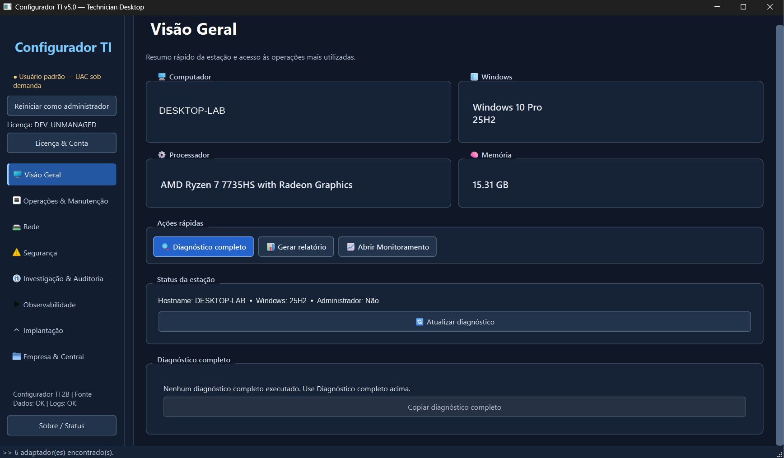
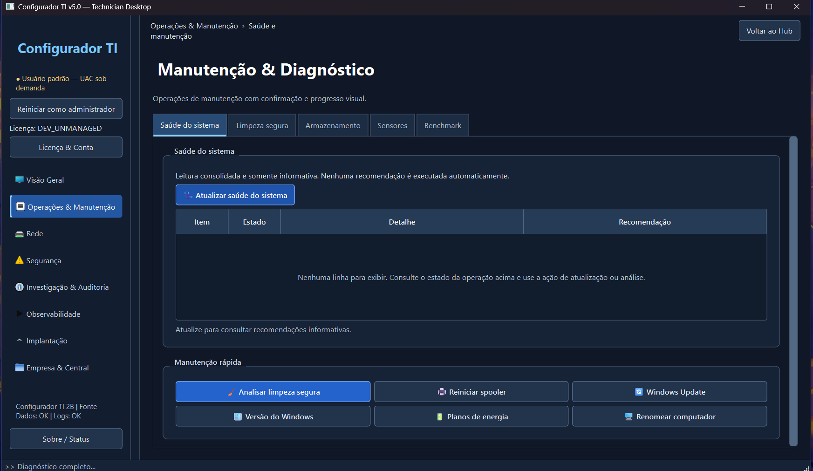
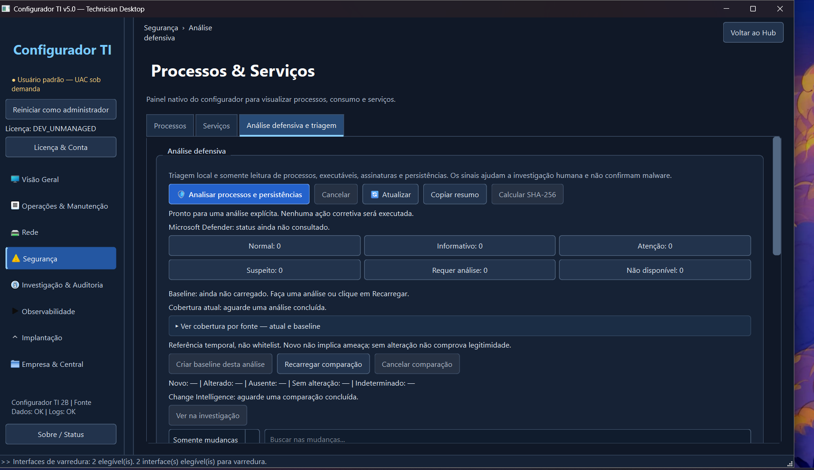
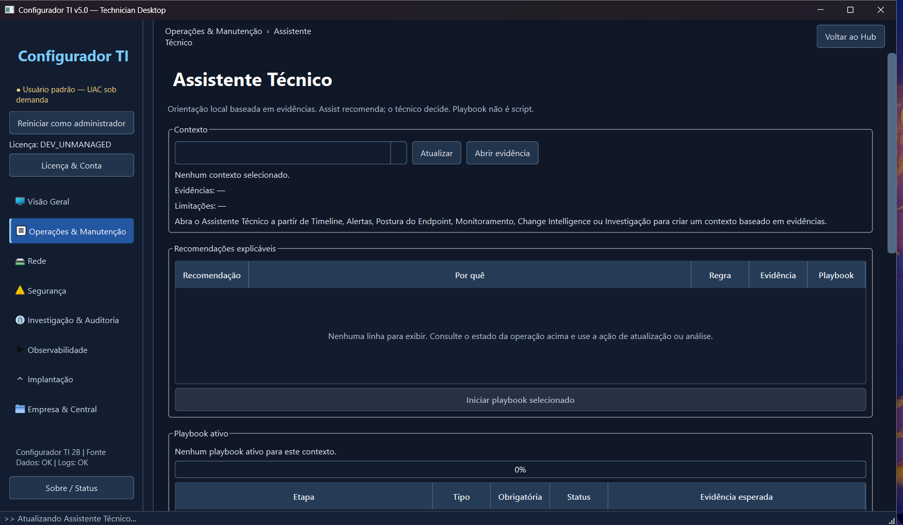
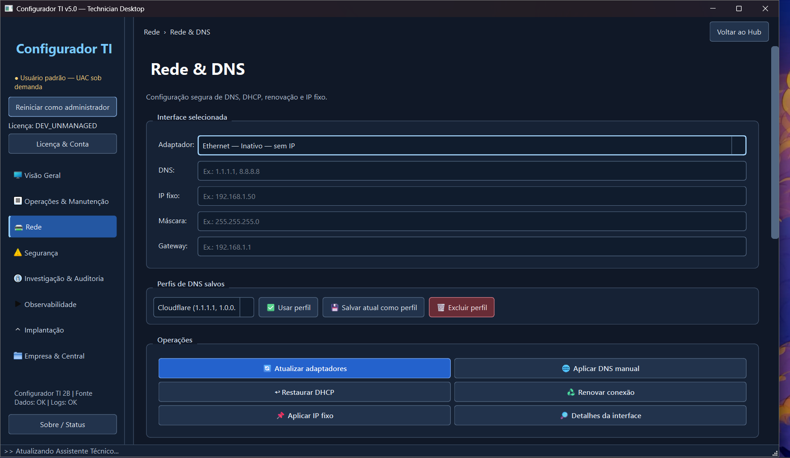
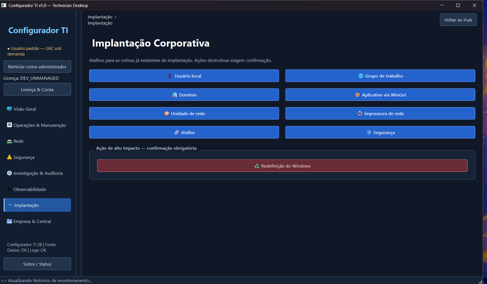

# Configurador TI 🖥️

Aplicação desktop em desenvolvimento para **diagnóstico, inventário, manutenção, monitoramento, automação e apoio à administração de computadores Windows**.

> **Status:** desenvolvimento ativo / em validação de QA.  
> **Regressão automatizada atual:** 844 testes — 841 aprovados, 3 ignorados por dependência de ambiente/plataforma e 0 falhas.  
> **Validações nativas Windows:** ainda em andamento antes de uma versão considerada estável.

## 📌 Visão geral

O **Configurador TI** nasceu da observação de rotinas recorrentes de suporte técnico e da ideia de reunir, em uma única interface, informações e ferramentas que normalmente ficam distribuídas entre diferentes utilitários, comandos e telas do Windows.

O projeto é desenvolvido como iniciativa pessoal de estudo e evolução prática em desenvolvimento de software, automação, Windows, redes, segurança da informação e qualidade de software.

Entre os recursos atualmente implementados estão:

- diagnóstico do computador e inventário de hardware e sistema;
- informações de rede, DNS e conectividade;
- discos, S.M.A.R.T. e armazenamento;
- sensores e monitoramento local;
- análise defensiva e postura do endpoint;
- logs, auditoria, Timeline e investigação;
- Assistente Técnico com playbooks guiados e ações controladas;
- motor transacional com confirmação, validação e rollback;
- Agent headless;
- Central Web e backend/API de referência para QA;
- empacotamento com PyInstaller e validações de distribuição.

## 🏗️ Arquitetura

A arquitetura atual possui quatro componentes principais:

```text
┌────────────────────────────┐
│ Technician Desktop (PyQt6) │
└─────────────┬──────────────┘
              │
              │ recursos locais / licenciamento
              ▼
┌────────────────────────────┐
│ Backend / Control Plane    │
└─────────────┬──────────────┘
              │ API local de QA
       ┌──────┴──────┐
       ▼             ▼
┌──────────────┐  ┌──────────────┐
│ Central Web  │  │ Agent        │
│ interface QA │  │ headless     │
└──────────────┘  └──────────────┘
```

Mais detalhes estão disponíveis em [`docs/ARCHITECTURE.md`](docs/ARCHITECTURE.md).

## 🛠️ Tecnologias

O projeto utiliza principalmente:

- Python
- PyQt6
- PowerShell
- WMI / CIM
- SQLite
- `cryptography`
- PyInstaller
- Git
- APIs e ferramentas nativas do Windows

## 📂 Estrutura do repositório

```text
Configurador-TI/
├── main_gui.py / main_gui.pyw    # interface e launcher gráfico
├── core_logic.py                 # lógica local principal
├── agent/                        # Agent headless / serviço Windows
├── central_web/                  # Central Web de QA
├── control_plane/                # backend e autoridade local de QA
├── fleet_protocol/               # contratos e transporte
├── licensing/                    # identidade e licenciamento
├── desenvolvimento/              # build, scanner, harness e testes
│   └── testes/
├── distribuicao/                 # instruções do pacote executável
├── docs/                         # documentação pública
└── assets/screenshots/           # capturas atuais da interface
```

O repositório público **não inclui** histórico interno de prompts, logs de validação, evidências intermediárias de QA, ZIPs internos, patches ou pacotes antigos da árvore mestre de desenvolvimento.

## ▶️ Executar em modo fonte

### Requisitos

- Windows 10 ou Windows 11
- Python 3.12 recomendado
- PowerShell disponível no sistema

Crie um ambiente virtual:

```powershell
py -3.12 -m venv .venv
.\.venv\Scripts\Activate.ps1
```

Instale as dependências:

```powershell
python -m pip install -r requirements.txt
```

Para iniciar a interface gráfica:

```powershell
python main_gui.py
```

Também é possível utilizar:

```text
INICIAR_CONFIGURADOR_TI.cmd
```

> Algumas funcionalidades dependem de recursos nativos do Windows. Determinadas ações administrativas podem solicitar elevação de privilégio apenas quando necessário.

## 🧪 Testes e QA

A regressão automatizada atual registra:

- **34 suítes**
- **844 testes**
- **841 PASS**
- **3 SKIP**
- **0 FAIL**
- `compileall`: PASS
- scanner de branding: PASS
- validações multiplataforma: PASS, com verificações nativas do Windows ainda pendentes

Para executar a suíte incluída no repositório:

```powershell
python -m unittest discover -s desenvolvimento/testes -p "test_*.py"
```

Alguns testes dependem de PyQt6 e determinados cenários possuem validações condicionais ao ambiente Windows.

Mais detalhes estão disponíveis em [`docs/TESTING.md`](docs/TESTING.md).

## 📦 Build e distribuição

O pipeline do projeto utiliza **PyInstaller**.

Para instalar as dependências de desenvolvimento:

```powershell
python -m pip install -r requirements-dev.txt
```

No Windows, o processo de geração da versão portátil pode ser iniciado por:

```text
CRIAR_EXE_E_PENDRIVE_TI_v5_0.bat
```

O pipeline preserva saídas anteriores, gera manifestos e checksums e realiza validações antes da distribuição.

## 🔐 Segurança e limites

O projeto ainda **não deve ser interpretado como uma solução RMM pronta para produção**.

A Central Web e o backend atualmente funcionam como componentes de referência e QA.

O desenho atual evita:

- shell remoto livre;
- upload e execução remota arbitrária;
- remediação automática sem confirmação;
- concessão silenciosa de privilégios.

O repositório público não contém chaves privadas, credenciais reais ou estado persistente de usuários.

Mais informações estão disponíveis em [`docs/SECURITY.md`](docs/SECURITY.md).

## 📷 Screenshots

Abaixo estão algumas telas da interface atual do Configurador TI.

### Visão Geral



Resumo da estação, informações principais do sistema e acesso rápido às operações mais utilizadas.

### Manutenção & Diagnóstico



Ferramentas de saúde do sistema, limpeza segura, armazenamento, sensores, benchmark e rotinas de manutenção.

### Análise defensiva



Área de triagem local para análise de processos, executáveis, assinaturas, persistências e comparação com baseline.

### Assistente Técnico



Assistente baseado em evidências, com recomendações explicáveis e playbooks guiados sob decisão do técnico.

### Rede & DNS



Configuração e diagnóstico de adaptadores, DNS, DHCP, IP fixo e perfis de rede.

### Implantação Corporativa



Atalhos para tarefas de preparação e implantação, incluindo domínio, usuários, aplicativos, unidades e impressoras de rede.

## 🗺️ Roadmap

Os principais passos antes de uma versão considerada estável incluem:

- validação completa em Windows real;
- build e smoke test de `ConfiguradorTI.exe` e `ConfiguradorTIAgent.exe`;
- validação do serviço Windows;
- validações de LocalService, ACL e DPAPI;
- validação da Central Web em navegador real;
- inclusão de screenshots atualizados;
- consolidação da documentação de release.

Mais detalhes estão disponíveis em [`docs/ROADMAP.md`](docs/ROADMAP.md).

## 👤 Autor

**Juan Pablo Oliveira de Azevedo**

- [LinkedIn](https://www.linkedin.com/in/juanpabloazevedo)
- [GitHub](https://github.com/juanpablooliveradeazevedo)

---

Projeto pessoal em desenvolvimento.

Este repositório representa uma versão pública de **portfólio e QA** e não uma declaração de prontidão para produção.
